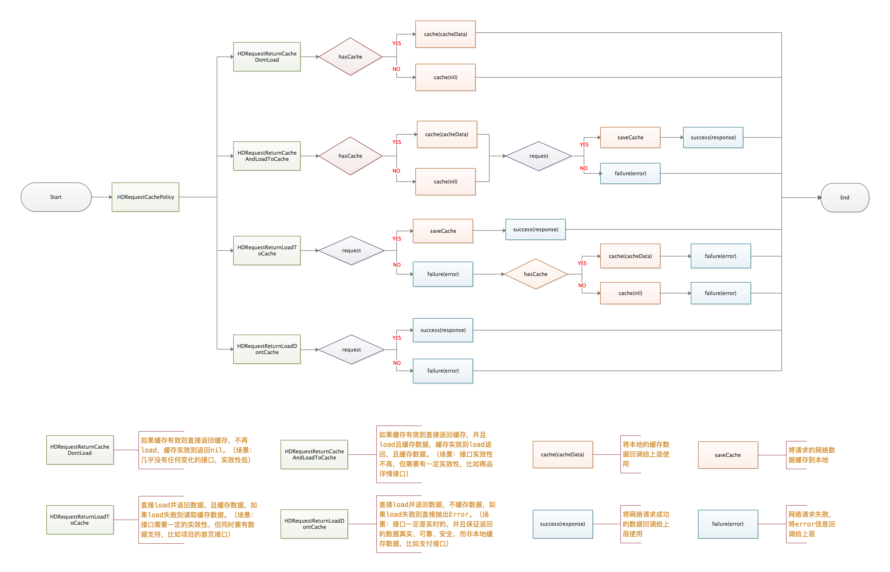

 

> 基于AFNetworking的v3.1.0进行网络请求，基于PINCache的v3.0.1进行网络数据缓存，支持清除指定url缓存、url及参数组合缓存，通过AFNetworkActivityLogger进行网络log打印。该代码使用灵活的请求方式，不包含任何业务代码，上层支持集中式、分布式网络接口管理方式，在请求前可以对请求进行配置，也支持对网络请求后返回的数据进行统一处理。

### 一、目的

HDDNetworking是为了实现网络请求而设计，作为整个网络请求中的中间层，底层调用目前主流的  [AFNetworking](https://github.com/AFNetworking/AFNetworking) ，当然也可以是 BFNetworking，但是无论是那种，对于上层业务层提供的接口，一直是可靠的、稳定的、方便的、带有缓存的接口，而无需各个业务端用N倍的时间处理底层网络的变更。


### 二、实现功能

#### **1、多环境切换功能：**

支持不同环境，快速切换对应环境的地址，也支持特殊的接口使用特殊环境的地址：

```objective-c
// 业务层代码
self.requestConvertManager = [HDRequestConvertManager sharedInstance];
// 不同环境设置不同的baseURL
self.requestConvertManager.configuration.baseURL = baseURL;

// 特殊的接口需要设置特殊的baseURL
[self.requestConvertManager requestMethod:HDRequestMethodPost
                                    URLString:SHOWAPI_LAUGHTER
                                   parameters:@{@"page" : @(pageIndex), @"maxResult" : @(pageSize)}
                         configurationHandler:^(HDRequestManagerConfig * _Nullable configuration) {
                             configuration.baseURL = otherBaseURL;
                         } cache:^(id  _Nullable responseObject) {
                             NSLog(@"缓存数据");
                             cache(responseObject);
                         } success:^(NSURLSessionTask * _Nullable dataTask, id  _Nullable responseObject) {
                             success(dataTask, responseObject);
                         } failure:^(NSURLSessionTask * _Nullable dataTask, HDError * _Nullable error) {
                             failure(dataTask, error);
                         }];
```

#### **2、处理多个接口中的通用配置：**

通用配置如 **请求的头部通用配置**、 **请求体的通用配置**、**接口的网络超时时长** 等等。

```objective-c
// 业务层代码
self.requestConvertManager = [HDRequestConvertManager sharedInstance];

//通过configuration来设置请求头
NSMutableDictionary *builtinHeaders = [NSMutableDictionary dictionary];
builtinHeaders[@"showapi_appid"] = SHOWAPI_APPID;
builtinHeaders[@"showapi_sign"] = SHOWAPI_SIGN;
self.requestConvertManager.configuration.builtinHeaders = builtinHeaders;

//通过configuration来设置通用的请求体
NSMutableDictionary *builtinBodys = [NSMutableDictionary dictionary];
builtinBodys[@"showapi_appid"] = SHOWAPI_APPID;
builtinBodys[@"showapi_sign"] = SHOWAPI_SIGN;
self.requestConvertManager.configuration.builtinBodys = builtinBodys;
```

#### **3、处理不同接口，存在的差异性：**

这里的差异性比如 **接口的网络超时时长**、**数据缓存时长**、**数据缓存协议** 等等，其实这里的几个地方，都有默认值，支持差异化请求。

```objective-c
// 业务层代码
self.requestConvertManager = [HDRequestConvertManager sharedInstance];

// 特殊的接口需要设置特殊的baseURL
[self.requestConvertManager requestMethod:HDRequestMethodPost
                                    URLString:SHOWAPI_LAUGHTER
                                   parameters:@{@"page" : @(pageIndex), @"maxResult" : @(pageSize)}
                         configurationHandler:^(HDRequestManagerConfig * _Nullable configuration) {
                           //设置缓存时长为100000秒
							configuration.resultCacheDuration = 100000;    
                           //优先取缓存数据，不在请求网络数据
                            configuration.requestCachePolicy = HDRequestReturnLoadToCache;    
                         } cache:^(id  _Nullable responseObject) {
                             NSLog(@"缓存数据");
                             cache(responseObject);
                         } success:^(NSURLSessionTask * _Nullable dataTask, id  _Nullable responseObject) {
                             success(dataTask, responseObject);
                         } failure:^(NSURLSessionTask * _Nullable dataTask, HDError * _Nullable error) {
                             failure(dataTask, error);
                         }];
```

#### **4、对网络请求返回的数据做一层拦截：**

这里举例说明一下，就是一些app中，登录态只是持续一段时间的，但是一些接口必须要登录态有效才能访问的，这个时候一般姿势可能是，对这些需要判断登录态的接口的返回数据进行筛选判断，然后再做下一步处理，随着这样的接口满满的变多，就导致搞不清到底这一套判断写在哪里了。可能有遇到过这种情况的老司机选择了在自己封装的网络请求 [AFNetworking](https://github.com/AFNetworking/AFNetworking)  那段代码返回的时候统一的加上这层逻辑，这的确是一种省时省力的方式，但是问题就在于老司机做的这层 组件 也被业务代码给玷污了。😂

我的思路其实也是如此，这层拦截的代码也是加在网络请求 [AFNetworking](https://github.com/AFNetworking/AFNetworking)  那段代码返回的地方，但是我使用了block，把原始数据回调给业务层本身，也就意味了业务层自己处理自己的拦截。

```objective-c
// 业务层代码
self.requestConvertManager = [HDRequestConvertManager sharedInstance];

//通过configuration来统一处理输出的数据，比如对token失效处理、对需要重新登录拦截
self.requestConvertManager.configuration.resposeHandle = ^id (NSURLSessionTask *dataTask, id responseObject) {
  	responseObject = [responseObject doSomething];
	return responseObject;
};


//HDRequestConvertManager.m
self.requestManager = [AFHTTPSessionManager manager];
[self.requestManager dataTaskWithRequest:request
completionHandler:^(NSURLResponse * _Nonnull response, id  _Nullable responseObject, NSError * _Nullable error) {
    __strong typeof(self) strong_self = weak_self;
    if (error) {
        
    }
    else {
      	//如果业务层需要拦截，则先将返回的数据抛给业务层先处理
        if (configuration.resposeHandle) {
            responseObject = configuration.resposeHandle(dataTask, responseObject);
        }
        success(dataTask, responseObject);
    }
}];
```

#### **5、网络数据缓存策略**：

 

缓存这块使用的是 [PINCache](https://github.com/pinterest/PINCache) ，策略分了四种方式，具体可以看上图。

#### **6、log日志的完善机制：**

这块使用的是 AFNetworkActivityLogger 这个类来实现，它也是可以根据开发者选择的log等级来打印对应级别的log，支持打印请求的 `HTTPMethod` 、`URL` 、`absluteString` 、网络请求响应的`statusCode` 、本次请求耗时等等信息，它是利用  [AFNetworking](https://github.com/AFNetworking/AFNetworking)  请求发出的通知来实现的，具体看源码。

#### **7、error层的自定义统一管理：**

组件中已经包含一个比较基础的 HDError 类，业务层继承这个然后重载如下的两个类方法即可：

```objective-c
+ (HDError *)hdErrorNetNotReachable;
+ (HDError *)hdErrorHttpError:(NSError *)error;
```

#### **8、网络状态的判断：**

这个没有好说的，还是 [AFNetworking](https://github.com/AFNetworking/AFNetworking) 那一套：

```objective-c
//HDRequestConvertManager.m
[[AFNetworkReachabilityManager sharedManager] setReachabilityStatusChangeBlock:^(AFNetworkReachabilityStatus status) {
	NSLog(@"Reachability: %@", AFStringFromNetworkReachabilityStatus(status));
	self.networkStatus = status;
}];
```

#### 9、取消网络请求：

在调用组件中的网络接口时，本身是返回请求的对象 `NSURLSessionTask` 的，如果需要取消，只需要拿到这个对象，执行 cannel 即可，当然，所有的请求都在 [AFNetworking](https://github.com/AFNetworking/AFNetworking) 排好队的，组件也提供接口来取消队列中的所有请求：

```objective-c
//HDRequestConvertManager.m
- (void)cancelAllRequest {
    [self.requestManager invalidateSessionCancelingTasks:YES];
}
```


### 三、业务层实现的一些思路

关于采用何种方式，iOS届大神早已分析的很透彻了，比如这里： [iOS网络层架构设计分享](http://www.jianshu.com/p/05a59197a7c7) 和  [iOS应用架构谈 网络层设计方案](https://casatwy.com/iosying-yong-jia-gou-tan-wang-luo-ceng-she-ji-fang-an.html) ，我结合自己的一些经验总结一下

#### 1、集约性Api调用方式：demo中的 `HDRequestManager`

这个是我一直使用好几年的一种方式了，因为它好用，好管理，看上去很整洁等等，当然在看过上面大神博客才知道它有一个响亮的名字：**集约型Api调用方式**。因为开发过程中接口相对而言比较少，没有很大的发现，而且每次新的接口中都很方便的看到接口的记录：

```objective-c
#pragma mark - 1.0版本接口 by dlb 2016.05.07 - 2016.05.18
// 首页接口
- (void)homePageSRequest...;
// 广告区接口
- (void)bannerListRequest...;

#pragma mark - 1.1版本接口 2016.05.20 - 2016.06.08
// 图书列表接口
- (void)bookListRequest...;
```

对于它的缺点，比如当接口很多的时候，或者多人维护时代码提交老是冲突的缺陷，我想说，是有办法解决的，比如使用 `Category`，😁

```objective-c
HDRequestManager+Home.h
HDRequestManager+Me.h
HDRequestManager+Order.h
```

#### 2、离散性Api调用方式：demo中的 `HDBaseViewModel`

这种方式是 [casa大神](https://casatwy.com/) 推荐的一种，它能解决集约型Api请求方式的一些缺陷，比如：针对某个api请求进行AOP时，需要对api进行判断然后AOP；比如api请求还未结束，业务层已经被用户返回释放掉，容易造成的crash等等。

使用 **离散性Api调用方式** 则能很好的解决这些问题，而且现在随着 MVP、MVVM 等架构的兴起，需要更加独立的model层来进行单元测试，这很合 **离散性Api调用方式** 的胃口。如何采用  **离散性Api调用方式** 呢？demo中也有一个简单的例子，看上去是很棒，用起来也很随性。

如果项目中有好几百个api，按照接口有一定的相似度来分析，3个接口对应一个viewModel，无意中变多上上百个类，怎么管理？要分散到各个业务模块吗？

#### 3、如何选择？

按照我的意愿，还是会选择 **集约型Api调用方式**。原因就是无论viewModel是分散在各个业务模块，还是统一在一块，我都感觉维护起来是一个问题。至于它的缺陷，我想总是有办法解决的 😄 大神轻喷 😄。


### 四、如何添加到项目中？

先已加入  [CocoaPods](http://cocoapods.org) 套餐，欢迎使用，欢迎大神教育。

[](https://travis-ci.org/erduoniba/HDNetworking)

[](http://cocoapods.org/pods/HDNetworking)

```ruby
pod "HDDNetworking"
```


[项目源码地址](https://github.com/erduoniba/HDNetworking) 欢迎 **star**